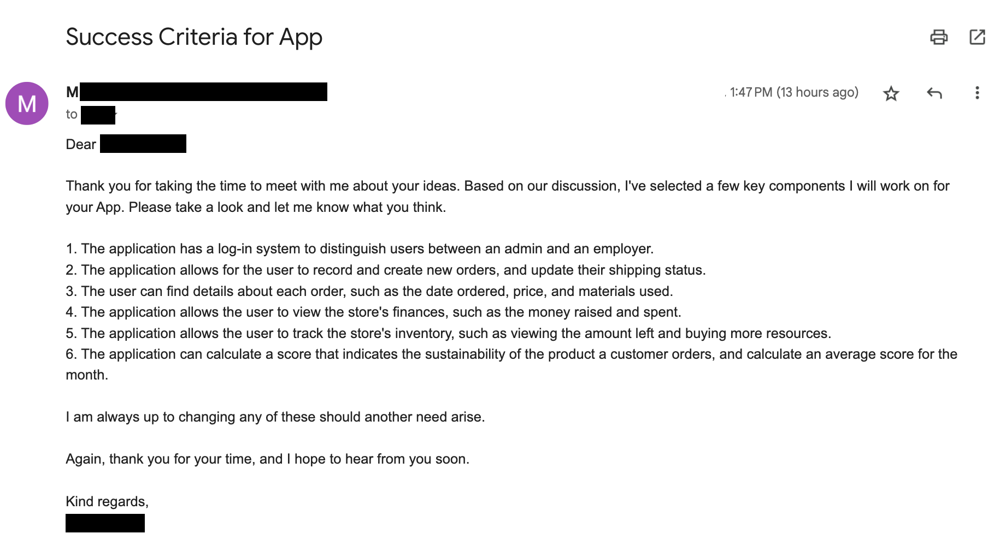
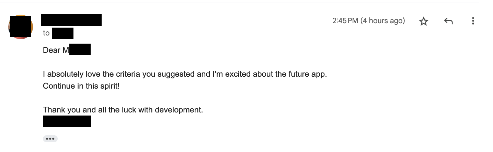
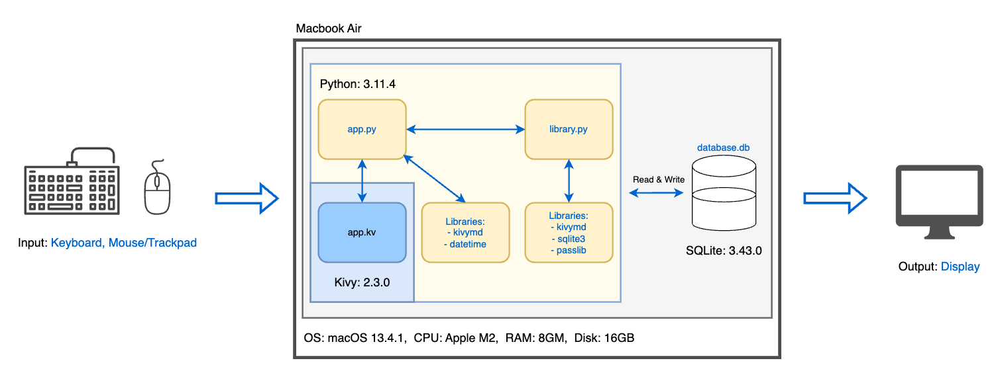
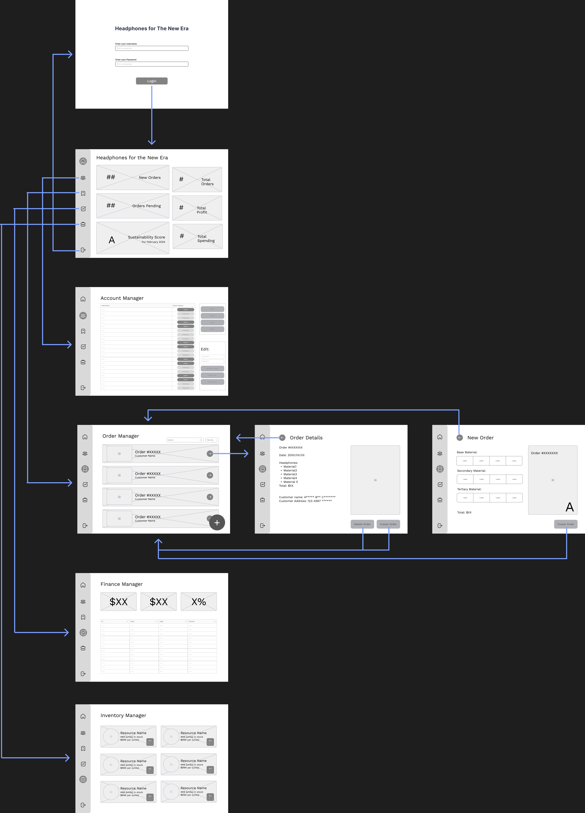
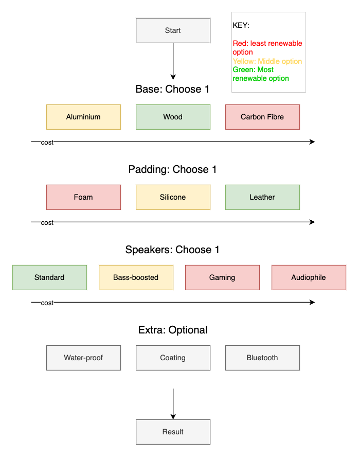
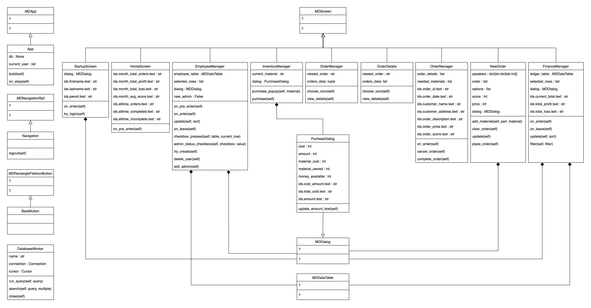
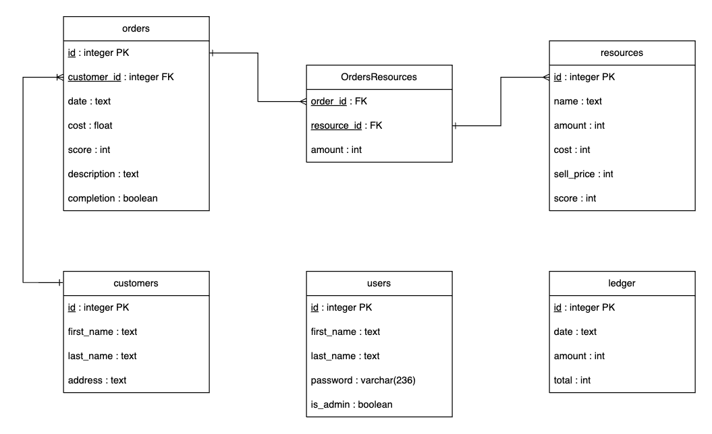
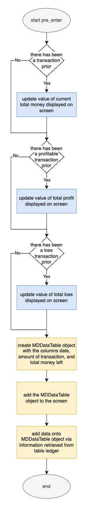
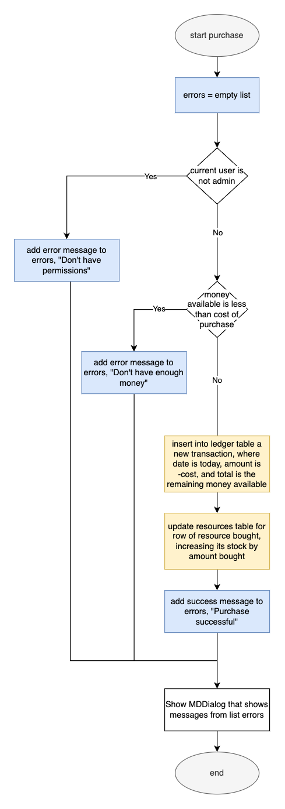
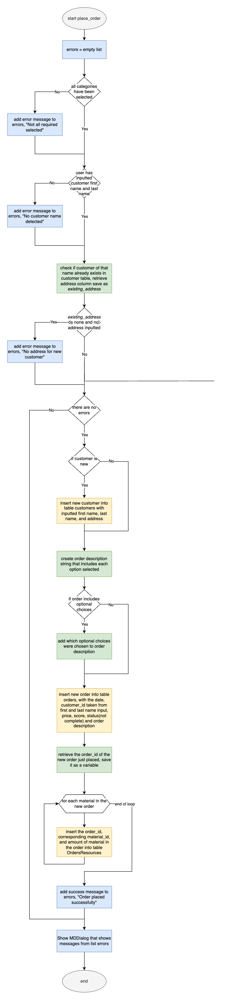

# Unit 3: Comapany Manager Application

  
<sub>"Frog VIbing GIF" by LINE FRIENDS, *https://giphy.com/gifs/LINEFRIENDS-frog-leonard-linefriends-6FxJBpNTBgWdJCXKD4*</sub>

## Criteria A: Planning
### Problem Definition
Headphones for the New Era (in this document referred to as HNE) is a new gadget producer that creates headphones, with a special emphasis on their products’ sustainability. The founder of the company has expressed difficulties in keeping track of placed orders, financing revenue, and managing inventory with the amount of orders they are getting. As a result, HNE is planning on implementing a digital system accessible to employees to help with running the store.

At the moment, HNE receives orders in-store, and ships the product later to the customer. The employees write down notes-- physical or electronic-- of the order and customer's details, and passes it to the store manager at the end of the day. This manager is then responsible for inputting the information into a spreadsheet. This spreadsheet is then viewed by employees of the factory division, who create the order and ship it to the address provided. Additionally, as of now, the manager of the factory division is solely responsible for keeping track of the amount of resources they have left, and purchasing more from partnered suppliers should it be necessary.

As a result of this lengthy process made to ensure only trustable, higher-ranking individuals have the permissions to add and edit valuable information, HNE has found that it slow down the efficiency of the company. HNE hence wishes to change this portion of manual labor into a smoother digital system for the employees in the store, to increase their rate of production and revenue.

### Proposed Solution
I will be using Python to create the app. Being an interpreted language, Python is supported on all major operating systems and architectures, in comparison to compiled languages including Java, another popular language for app development. As long as Python is installed, it will be compatible with most if not any computer in the world. This is suitable if the store requires an upgrade to their computer in the near future, or decides to relocate and change their computer systems. Python is also an open-source language, meaning no license needs to be purchased. This is an advantage, as the store will not need to pay for the language, and can use the money saved to invest in other areas of the business. [^1] Likewise, considering that the platform the app will be on is a computer and not a mobile device, it makes more sense to use a language that is more commonly used for computer applications, ruling out languages such as Swift and Kotlin. [^2]

Similarly, I have chosen to use the Kivy framework in this task. Kivy was developed specifically for Python, making it one of the most compatible application building frameworks with my language chosen. Like Python, it is multi-platform, holding up to the advantage of the created application being easily transportable between different devices. [^3] kivyMD is an extension of Kivy, that provides Material Design components. This is an advantage, especially for HNE as the Material Design components fit its brand image of being modern and sustainable. [^4]

Lastly, I will be using SQLite for the database. First, CSV and JSON files were considered, but considering the complexity of the data that needs to be stored, and the interrelation between data from different tables, a database was chosen. [^5] Amongst different databases, SQLite is advantageous as it is serverless, meaning it does not require a separate server process. This is an advantage for HNE, as it does not need to pay for a server, and can use the money saved elsewhere in the business. [^6]
Again, like both Python and kivyMD which were chosen, SQLite is also multi-platform, keeping the application portable between different devices. [^7] Compared to MYSQL, another popular database, SQLite is better suited for single-user applications, which reflect the case of HNE, as the employees will be using a single computer to access the same application. [^8]

[^1]: Merrill, Cache. "7 Important Reasons Why You Should Use Python." Zibtek, 1 September 2019, https://www.zibtek.com/blog/7-important-reasons-why-you-should-use-python/
[^2]: Yakymiv, Volodymyr. "Choosing the Best Language for App Development: 7 Options to Consider." Forbytes, 3 November 2023, https://forbytes.com/blog/best-language-for-app-development/
[^3]: "Kivy Tutorial." Free Learning Platform For Better Future, https://www.javatpoint.com/kivy#AdvantagesDisadvantages
[^4]: "Building a Simple Application using KivyMD in Python." GeeksforGeeks, https://www.geeksforgeeks.org/building-a-simple-application-using-kivymd-in-python/ 
[^5]: "Should you use CSV, JSON, or SQL?." PythonHow, https://pythonhow.com/python-tutorial/miscellaneous/csv-json-or-sql/
[^6]: "AQLite Is Serverless." SQLite, https://www.sqlite.org/serverless.html
[^7]: "SqLite Advantages." Free Learning Platform For Better Future, https://www.javatpoint.com/sqlite-advantages-and-disadvantages
[^8]: Yugulalp, Serdar. "Why you should use SQLite." Infoworld, 13 February 2019, https://www.infoworld.com/article/3331923/why-you-should-use-sqlite.html

### Design Statement
Using python and KivyMD I will create a GUI application for HNE in which a user can store and edit data for the business on an SQLite Database. The application will take approximately 1.5 months to create, and will have the key components/features as listed below in my success criteria.

### Success Criteria
1. The application has a log-in system to distinguish users between an admin and an employer.
   - [issue solved: “There should be a login system.” (2024/02/01 meeting)]
2. The application allows for the user to record and create new orders, and update their shipping status.
   - [issue solved: “The person ordering is going to choose from a few specifications" "The supplier should be able to update (the order's shipping) status” (2024/02/01 meeting)]
3. The user can find details about each order, such as the date ordered, price, and materials used.
   - [issue solved: “If you’re the supplier you can view different orders you have and their content” (2024/02/01 meeting)]
4. The application allows the user to view the store's finances, such as the money raised and spent.
   - [issue solved: “The user should see some sort of summary on how much money he has invested into the materials he is ordering” (2024/02/01 meeting)]
5. The application allows the user to track the store's inventory, such as viewing the amount left and buying more resources.
   - [issue solved: "Since each order needs materials that should also be tracked" (2024/02/01 meeting)]
6. The application can calculate a score that indicates the sustainability of the product a customer orders, and calculate an average score for the month.
   - [issue solved: "A sustainability scale when people pick out their material would be very cool." (2024/02/01 meeting)]

#### Client Approval of Success Criteria

**Fig.1** *Email to client proposing success criteria*


**Fig.2** *Reply of approval from client*

## Criteria B: Design
### System Diagram

**Fig.3** *System diagram of proposed solution*

### Application Wireframe

**Fig.4** *Wireframe of the application design, created on Figma using components from Wireframes Kit [Free] by Nailul Izah (https://www.figma.com/community/file/1122167340874425914)*

### Flowchart of Customer Ordering Process

**Fig.5** *Flowchart describing the ordering process of the sold product*

### UML Diagram

**Fig.6** *UML diagram of proposed solution*

### ER Diagram

**Fig.7** *ER diagram of database*

### Flow Diagrams

**Fig.8** *Flow diagram of `on_pre_enter` method from class `FinanceManager`*


**Fig.9** *Flow diagram of `purchase` method from class `InventoryManager`*


**Fig.10** *Flow diagram of `place_order` method from class `NewOrder`*

### Record of Tasks
| Planned Action                                    | Planned Outcome                                                                                                                                     | Time estimate | Target completion date | Criteria |
|---------------------------------------------------|-----------------------------------------------------------------------------------------------------------------------------------------------------|---------------|------------------------|----------|
| Write problem definition                          | Meet with client and finalize a description of the problem.                                                                                         | 30min         | Feb 1                  | A        |
| Suggest and finalize success criteria with client | Meet with client again and receive feedback on proposed success criteria for the solution.                                                          | 30min         | Feb 5                  | A        |
| Write proposed solution                           | Finalize the success criteria and form a proposed solution to justify the methods that will be used.                                                | 30min         | Feb 6                  | A        |
| Create wireframe for application                  | Plan the frontend structure of the application by creating a wireframe of the app.                                                                  | 2hr           | Feb 8                  | B        |
| Create diagrams                                   | Create UML and ER diagrams to plan the backend structure of the app.                                                                                | 2hr           | Feb 10                 | B        |
| Create test plan                                  | Create a test plan to use when checking if the application works, and is up to standards.                                                           | 15min         | Feb 11                 | B        |
| Create basic screens and link planned screens     | Create basic/blank screens for all planned screens in the application, compile them into a ScreenManager and make it possible to move between each. | 1hr           | Feb 12                 | C/D      |
| Create login screen                               | Create a login function that retrieves user data from a database, allowing users to log into the application.                                       | 1hr           | Feb 13                 | C/D      |
| Create employee manager screen                    | Create an employee manager screen that allows admin users to view and edit existing employees, as well as create new employee accounts.             | 1hr           | Feb 15                 | C/D      |
| Create inventory screen                           | Create an inventory screen that allows users to view the amount of resources in stock, and allows admin users to puchase more resources.            | 2hr           | Feb 20                 | C/D      |
| Create order creation screen                      | Create an order creation function that allows users to create a new order and save it to a table of all orders.                                     | 1hr 30min     | Feb 22                 | C/D      |
| Create order details screen                       | Create an order details screen that allows users to view the details of a given order in the table.                                                 | 1hr 30min     | Feb 24                 | C/D      |
| Create order list screen                          | Create an order list screen that lists all of the orders in the table, and links to the order details screen of each unique order.                  | 1hr 30min     | Feb 26                 | C/D      |
| Create finance manager screen                     | Create an finance manager screen that allows users to view all transactions made, filterable by date, type, and amounts.                            | 1hr           | Feb 28                 | C/D      |
| Run tests                                         | Run tests as specified in the Test Plan, and fix bugs acoordingly.                                                                                  | 2hr           | Mar 1                  | B/C/D    |
| Adjust and finalize UI                            | Adjust UI (e.g. size, layout) to promote user friendliness, stylize to promote company brand image.                                                 | 1hr 30min     | Mar 3                  | C/D      |
| Run tests again                                   | Run tests as specified in the Test Plan again to ensure that any changes made to UI didn't interfere with functionality.                            | 30min         | Mar 3                  | B        |
| Meet with client for evaluation                   | Meet with client for a final evaluation on the application as a solution to the problem.                                                            | 30min         | Mar 10                 | A/D      |

### Test Plan
|    | Test Type           | Test Content                                                                                                                          | Input                                                                                                                                                                                                                                                                                                                                                                                                                      | Expected Output                                                                                                                                                                                                                                                                                                                |
|----|---------------------|---------------------------------------------------------------------------------------------------------------------------------------|----------------------------------------------------------------------------------------------------------------------------------------------------------------------------------------------------------------------------------------------------------------------------------------------------------------------------------------------------------------------------------------------------------------------------|--------------------------------------------------------------------------------------------------------------------------------------------------------------------------------------------------------------------------------------------------------------------------------------------------------------------------------|
| 1  | Unit                | Login and Logout                                                                                                                      | 1. Attempt log-in by pressing login button without any input into provided text fields 2. Attempt log-in by inputting "bo" as first name, "bobbers" as last name, and "bob123" as password 3. Attempt log-in by inputting "bob" as first name, "bobbers" as last name, and "bo123" as password 4. Attempt log-in by inputting "bob" as first name, "bobbers" as last name, and "bob123" as password 5. Press logout button | 1. popup saying "Employee does not exist." shows up 2. popup saying "Employee does not exist." shows up 3. popup saying "Password is incorrect." shows up 4. user is redirected to Home 5. user is redirected to Startup                                                                                                       |
| 2  | Unit                | Create new user, delete user                                                                                                          | 1. Log-in as user bob bobbers 2. In EmployeeManager, input "bob" as first name, "bobbers" as last name, "password" as password, is_admin as False 3. Input "adam" as first name, "anderson" as last name, "password" as password, is_admin as False 4. Delete user adam anderson                                                                                                                                           | 1. popup saying "User with same name already exists." shows up 2. popup saying "User created successfully." shows up 3. popup saying "User(s) deleted successfully" shows up                                                                                                                                                   |
| 3  | Integration         | Login, go to EmployeeManager and create a new account, log-in with new account details                                                | 1. Log-in as user bob bobbers (same user details as 1st test) 2. Move to EmployeeManager Screen by pressing navigation button 3. Create account adam anderson (same user details as 2nd test) 4. Press logout button 5. Log-in as user adam anderson (same user details as 2nd test)                                                                                                                                       | 1. user is redirected to Home 2. user is redirected to EmployeeManager 3. popup saying "User created successfully." shows up 4. user is redirected to Startup 5. user is redirected to Home                                                                                                                                    |
| 4  | Unit                | Purchase Resources                                                                                                                    | 1. Log-in as user bob bobbers (same user details as 1st test) 2. Move to InventoryManager Screen by pressing navigation button 3. Press icon button on card labeled "Wood" 4. Input 10 into textfield and press purchase button                                                                                                                                                                                            | 1. user is redirected to Home 2. user is redirected to InventoryManager 3. popup titled "Purchase Wood?" appears 4. popup saying "Purchase Successful!" shows up 5. value of column amount of row where value of name is "wood" of table Resources in database is 10                                                           |
| 5  | Integration         | Purchase Resource, go to FinanceManager and check for updated table                                                                   | 1. Same steps as 5th test 2. Move to FinanceManager Screen by pressing navigation button                                                                                                                                                                                                                                                                                                                                   | 1. Purchase of resources is successful 2. Latest row in datatable has values id 2, date (date of testing), amount -100 3. labels on side of screen are "current balance $900", "total profit $0", and "total loss $-100"                                                                                                       |
| 6  | Unit                | Create New Order                                                                                                                      | 1. Log-in as bob bobbers (same user details as 1st test) 2. Move to OrderManager 3. Press "New" button 4. Press buttons "aluminium", "foam", "standard", "coating" 5. Attempt creation of order using inputs "carla" as customer first name, "carlson" as customer last name, "123-4567" as customer address                                                                                                               | 1. user is redirected to Home 2. user is redirected to OrderManager 3. user is redirected to NewOrder 4. row of buttons disable when pressed 5. popup saying "Order placed successfully." shows up                                                                                                                             |
| 7  | Unit                | View Order Details                                                                                                                    | 1. Same steps as 6th test 2. Move to OrderManager 3. Select button Order #1 from list                                                                                                                                                                                                                                                                                                                                      | 1. Placement of order is successful 2. user is redirected to OrderManager 3. user is redirected to OrderDetails 4. Text of MDLabels are updated to information of order                                                                                                                                                        |
| 8  | Unit (/Integration) | Create and Ship Product                                                                                                               | 1. Same steps as 7th test 2. Press "Box and Ship" button 3. Move to InventoryManager 4. Purchase 10 each of aluminium, foam, copper, zinc, lithium 5. Move to OrderDetails via OrderManager 6. Press "Box and Ship button                                                                                                                                                                                                  | 1. OrderDetails are successfully updated 2. popup saying "not enough aluminium...lithium" shows up 3. user is redirected to InventoryManager 4. each purchase is followed by popup saying "Purchase Successful!" 5. the OrderDetails are still the same 6. popup saying "order completed successfully." shows up               |
| 9  | Unit (/Integration) | Create and Ship Product, go to FinanceManager and check for updated table                                                             | 1. Same steps as 8th test 2. Move to FinanceManager                                                                                                                                                                                                                                                                                                                                                                        | 1. popup saying "order completed successfully." shows up 2. last row of datatable has values id 8, date (date of testing), amount 200 3. labels on side of screen are "current balance $600", "total profit $1200", and "total loss $-600"                                                                                     |
| 11 | System              | Login as admin, attempt account creation and resource purchase, create a new order and ship product, check FinanceManager, logout     | 1. Log-in as user bob bobbers 2. In EmployeeManager, input user details for adam anderson (same as 2nd test) and create account 3. In InventoryManager, purchase 10 of "aluminium", "foam", "lithium", "cobalt", "zinc" 4. In NewOrder, create same order as from 6th test 5. In OrderDetails of new order, press "Box and Ship" 6. Check FinanceManager if table has been updated 7. Logout                               | 1. user is redirected to Home 2. popup saying "user successfully created" shows up 3. popup saying "purchase successful!" shows up 4. popup saying "order placed successfully shows up" 5. popup saying "order completed successfully" shows up 6. finance manager has updated 7. user is redirected to Startup                |
| 12 | System              | Login as non-admin, attempt account creation and resource purchase, create a new order and ship product, check FinanceManager, logout | 1. Log-in as user adam anderson 2. In EmployeeManager, attempt new user creation 3. In InventoryManager, attempt resource purchase 4. In NewOrder, create same order as 6th test 5. In OrderDetails of new order, press "Box and Ship" 6. Check FinanceManager 7. Logout                                                                                                                                                   | 1. user is redirected to Home 2. popup saying "You do not have these permissions" show up 3. popup saying "You do not have these permissions" show up 4. popup saying "Order placed successfully shows up" 5. popup saying "Not enough resources" shows up 6. finance manager has not changed 7. user is redirected to Startup |

## Criteria C: Development
### Techniques used
1. If/Else Statements
2. For/While Loops
3. Input Validation
4. Functions
5. Classes, encapsulation and decapsulation
6. Hashing
7. Databases
8. Widgets

### Packages/Libraries used
1. sqlite3
2. kivy
2. kivymd
2. passlib
2. datetime

### Development
#### Use of Databases (sqlite)
First, to make working with the database easier, a class called `DatabaseWorker` is created in `library.py`. This class is used to create a connection to the database, and pre-define common code that is used when running queries. The class is defined as follows:
```.python
class DatabaseWorker:
    def __init__(self, name: str):
        self.name_db = name

        # Step 1: Create a connection
        self.connection = sqlite3.connect(self.name_db)
        # Step 2: Set cursor/where it inputs into table
        self.cursor = self.connection.cursor()

    def run_query(self, query: str):
        self.cursor.execute(query)  # Run query
        self.connection.commit()  # Save changes

    def search(self, query: str, multiple: bool = False):
        results = self.cursor.execute(query)
        self.run_query(query)
        if multiple:
            return results.fetchall()  # Fetchall returns multiple rows
        else:
            return results.fetchone()  # Fetchone returns single row

    def close(self):
        self.connection.close()
```
The `DatabaseWorker` class is initialized with a string `name` that is used to define the name of the database. It then creates a connection to the database using the `connect` function and sets the cursor using the `cursor` function from the `sqlite3` library.
In the `run_query` method, the method first runs a command based on a given query using `execute`, and then saves any changes made to the database using the `commit` functions from the library. The `search` function is used to search the database for values, given such a query. The `multiple` parameter is a boolean, which indicates the user is looking for/expecting multiple results from their query if True. The method first saves the results from running the query using the method as previously defined. If multiple is set to true, the method returns all applicable results using the `fetchall` function, but otherwise returns a single result using `fetchone`. The `close` method is defined so that the connection to the database can be closed.

#### Success Criteria 1: Log-in System
As per success criteria 1, the application needs a log-in system, to prevent the access of non-employees and distinguish permissions between each user. To do this, a table in the database `database.db` is created to store the user data (see Fig.6). The table is created with the following SQL command:
```.sqlite
create table if not exists users(
    id integer primary key,
    first_name text not null,
    last_name text not null,
    password varchar(256) not null,
    is_admin boolean);
```
This command creates a table called `users` with the columns `id`, `first_name`, `last_name`, `password`, and `is_admin`. The `id` column is the primary key, and is used to identify each user. Each of the other columns store its corresponding data. The `password` column is specified as a string of max 256 characters. This is because a password (due to its sensitivity) should be hashed, and to do so effectively with sha256 which will be used, it should be less than 256 characters. To distinguish permissions, the `is_admin` column is used to store a boolean value that indicates whether the user is an admin (full permissions) or not.

Using the library `passlib`, it is possible to create functions that create hashes and check hashes. The following functions are created in `library.py` and used to hash and verify passwords in the application.
```.python
# Functions for hashing/verification
hasher = sha256_crypt.using(rounds=30000)


def make_hash(text: str) -> str:
    """Given a string, returns the hashed version (using sha256) of the string."""
    return hasher.hash(text)


def check_hash_match(text: str, hashed: str) -> bool:
    """Given a string and a hashed string, returns True if the string matches the hashed string, returns False if the 
    string doesn't match the hashed string."""
    return hasher.verify(text, hashed)
```
In the first line, hasher is defined as using the sha256_crypt algorithm, with 30000 rounds of encryption.
Using this, the `make_hash` function takes a string and returns the hashed version of the string. The `check_hash_match` function takes a string (text) and a hashed string, and compares the hash of the text and the hash, returning True if they match and False if they don't.

The following kivy code is used to create the log-in screen within the GUI application. The screen first uses RelativeLayout to allow for a custom image background using FitImage. A MDCard widget displays the log-in form, which contains three MDTextField widgets for the user to input their first name, last name, and password. Unique ids are given to each so they can be accessed using python. An on_press event of the MDRaisedButton is set to call the `try_login function`, which is defined in the StartupScreen class in the python file.
```.kv
<StartupScreen>:
        MDRelativeLayout:
                FitImage:
                        source: "assets/bg.png"
                        size_hint: 1, 1
                        pos_hint: {'center_x': 0.5, 'center_y': 0.5}

                MDCard:
                        size_hint: 0.4, 0.9
                        pos_hint: {'center_x':0.25, 'center_y': 0.5}
                        md_bg_color: 1, 1, 1, 0.7

                        MDBoxLayout:
                                orientation: 'vertical'
                                size_hint: 1, 1
                                spacing: 20
                                padding: 50

                                MDLabel:
                                        text: "Employee Login"
                                        font_style: "H3"
                                        halign: "center"
                                        pos_hint: {"center_x": .5, "center_y": .5}

                                MDTextField:
                                        id: firstname
                                        hint_text: 'Enter first name'
                                        icon_left: 'numeric-1-circle-outline'
                                        size_hint_x: 0.8
                                        pos_hint: {"center_x": .5, "center_y": .5}

                                MDTextField:
                                        id: lastname
                                        hint_text: 'Enter last name'
                                        icon_left: 'numeric-2-circle-outline'
                                        size_hint_x: 0.8
                                        pos_hint: {"center_x": .5, "center_y": .5}

                                MDTextField:
                                        id: pword
                                        hint_text: 'Enter password'
                                        icon_left: 'key'
                                        size_hint_x: 0.8
                                        pos_hint: {"center_x": .5, "center_y": .5}
                                        password: True

                                MDRaisedButton:
                                        text: "Login"
                                        pos_hint: {"center_x": .5, "center_y": .5}
                                        on_press: root.try_login()
```
For the screen to work, the following python code is used to define `StartupScreen`. Within this, the `try_login` function is defined to check if the user's input matches any user in the database. If it does, the user is redirected to the home screen of the application. If it doesn't, an error message is displayed using the `show_popup` function.
```.python
class StartupScreen(MDScreen):
    def __init__(self, *args, **kwargs):
        super().__init__(args, kwargs)
        self.dialog = None

    def on_enter(self):
        self.ids.firstname.text = ""
        self.ids.lastname.text = ""
        self.ids.pword.text = ""

    def try_login(self):
        errors = []
        firstname = self.ids.firstname.text
        lastname = self.ids.lastname.text
        pword = self.ids.pword.text

        # Check if employee exists
        result = App.db.search(
            f"SELECT password, is_admin FROM users WHERE first_name = '{firstname}' and last_name='{lastname}'")
        if result is None:
            errors.append("Employee does not exist.")
        else:
            if not check_hash_match(hashed=result[0], text=pword):
                errors.append("Password is incorrect.")

        if len(errors) > 0:
            show_popup(self, errors, "OK")
        else:
            App.current_user = [firstname, lastname, result[1]]
            self.parent.current = "Home"
```
The class `StartupScreen` inherits from `MDScreen` and initializes using unknown arguments and keyword arguments. The `dialog` attribute is also initialized as None as there is no popup yet. The `on_enter` function is used to clear the text of the text fields when the screen is entered. The text stored in the MDTextFields are accessed using the ids defined in the kivy file, and changed to an empty string on entering the screen.
The `try_login` function is used to determine if the information inputted by the user is sufficient for them to log into the application as a user. First, an empty list `errors` is defined. This list will contain the messages the user will receive. The variables `firstname`, `lastname`, and `pword` are defined to store the content of each respective MDTextField. Next, using the `DatabaseWorker` object defined in the class `App`, the `search` function is used to search the table `users` for the values of `password` and `is_admin` of a user with first and last name as inputted in the log-in screen. An if statement checks if a user exists. If they don't an error message is appended to the `errors` list. If they do, the function `check_hash_match` checks if the password inputted by the user matches the hashed password in the database. If not, an error message is appended to the `errors` list. A following if statement calls the `show_popup` function, passing the list `errors` as a parameter if it is not empty (meaning there were errors). If the list is empty, `current_user` defined in `App` is set to a list containing the user's first name, last name, and whether they are an admin, and the user is redirected to the home screen of the application.

### Success Criteria 4: Finance Manager
As per success criteria 4, the application needs to allow the user to view the store's finances. To do this, a table `ledger` is created to store data of any monetary transactions made, such as revenue from completing orders and purchases of resources (see Fig.6). The table is created with the following SQL command:
```.sqlite
create table if not exists ledger(
    id integer primary key,
    date text,
    amount int,
    total int
);
```
This creates the table `ledger` with the columns `id`, `date`, `amount`, and `total`. The `id` column is the primary key, and is used to identify each transaction. Each of the other columns stores the corresponding data.

To view the store's finances, a class for the screen `FinanceManager` is created in `app.kv`. Alone, this screen contains MDLabels displaying information such as the current balance, total profit, and total loss, as well as some MDRaisedButtons. However, in combination with python, a MDDataTable widget can be added to this screen. The `FinanceManager` class is defined in `app.py` as follows:
```.python
class FinanceManager(MDScreen):
    def __init__(self, **kwargs):
        super().__init__(**kwargs)
        self.ledger_table = None
        self.dialog = None
```
The `FinanceManager` class inherits from `MDScreen` and initializes using keyword arguments. The `ledger_table` attribute, which represents the MDDataTable widget to be added, is initialized as None as there is no table yet. The `dialog` attribute is also initialized as None for now.

The following code is used to define the `on_pre_enter` method, which is used to create the table and add it to the screen when the screen is entered:
```.python
    def on_pre_enter(self): # Making a Table
        columns_names = [('id', 50), ('Date', 125), ('Amount', 125)]
        self.ledger_table = MDDataTable(
            size_hint=(0.58, 0.8),
            pos_hint={'center_x': 0.42, 'center_y': 0.45},
            use_pagination=True,
            rows_num=10,
            check=False,
            column_data=columns_names
        )
        self.add_widget(self.ledger_table)
        self.update()
```
(See Fig.8) In the first line, the list `columns_names` is defined as a list of lists. Each of the lists contain the name of the column and the width of the column. Next, the `ledger_table` attribute is defined as an MDDataTable object. The attributes of this table is defined within the parentheses, just like they would be in a kivy file. the `columns_names` variable is passed into `column_data`, to create the table with the respective titles and sizes. This table is then added to the screen using the `add_widget` function with `ledger_table` as an argument. At this point, there is no data on the table. Hence, the `update` method is called.

The `update` method is defined as follows:
```.python=
   def update(self, sort=None):
      query = 'Select id, date, amount from ledger'
      if sort is not None:
         query += f' order by {sort.strip("")}'

      data = App.db.search(query=query, multiple=True)
      self.ledger_table.update_row_data(None, data)
```
The method first creates a template sqlite query to select the `id`, `date`, and `amount` from the `ledger` table. Although `sort` parameter is set to None by default, having it leaves room to order and/or filter the data on the table using buttons or otherwise from the GUI. This is done in the application, where the `on_press` event of buttons defined in the `FinanceManager` class of `app.kv` is set to this `update` method whilst passing in a argument for `sort`. In these cases, if `sort` is not None, the query is modified to order the results by the value of `sort`. The `search` method is then used to run the query, saving the results onto the variable `data`. The `update_row_data` method derived from the `MDDataTable` class from the `kivymd` library is then used to update the data in the table with `data`. This successfully updates the table with the data from the `ledger` table in the database.

Just to avoid the widget from being created multiple times on top of each other at each entry of the screen, the `on_leave` method is defined to remove the table from the screen when the screen is left:
```.python
    def on_leave(self):
        self.remove_widget(self.ledger_table)
```


#### Success Criteria 5: Inventory
As per success criteria 5, the application needs to allow the user to track the store's inventory. To do this, first, the table `resources` is created to store the resource data, and an intermediate table `OrdersResources` needs to be created to satisfy the many-to-many relationship between orders and resources (see Fig.6). These tables are created with the following SQL commands:
```.sqlite
create table if not exists resources(
    id integer primary key,
    name text not null,
    amount integer,
    cost int,
    sell_price int,
    score int
);

create table if not exists OrdersResources(
    order_id int,
    resource_id int,
    amount int,
    foreign key (order_id) references orders(id),
    foreign key (resource_id) references resources(id)
);
```
The first command creates the table `resources` with the columns `id`, `name`, `amount`, `cost`, `sell_price`, and `score`. The `id` column is the primary key, and is used to identify each resource. Each of the other columns store its corresponding data. The second command creates the table `OrdersResources` with the columns `order_id`, `resource_id`, and `amount`. The `order_id` column stores the id of the order the resource is used in, the `resource_id` column stores the id of the resource, and the `amount` column stores the amount of that resource used in the order. The `order_id` and `resource_id` columns are foreign keys that reference the `id` column of each of the `orders` and `resources` tables.

To view the inventory, a class for the screen `InventoryManager` is created in `app.kv`. This screen is used to display and make purchases of the resources the company uses in their orders. Within this definition, the following code, an original adaptation from the kivymd documentation, is used to create an MDCard that represents each resource:
```.kv
MDCard:
      MDRelativeLayout:
              FitImage:
                      source: "assets/wood.png"
                      pos_hint: {"top": 1}
                      radius: (dp(16), dp(16), dp(16), dp(16))   
              MDIconButton:
                      icon: "plus"
                      pos_hint: {"top": 0.98, "right": 0.98}
                      md_bg_color: "white"
                      icon_size: 70
                      on_press: root.purchase_popup("wood")
              MDLabel:
                      text: "Wood"
                      theme_text_color: "Custom"
                      text_color: "white"
                      font_size: 50
                      adaptive_size: True
                      pos: "15dp", "15dp"
                      bold: True
```
Placing the components of the MDCard in a MDRelative Layout first allows to use FitImage in the shape of the card to create a image of the material as its background. An MDIconButton is created in the top right corner of the card, which when pressed, calls the `purchase_popup` method, passing the name of the resource as an argument. An MDLabel displays the name of the resource. This is repeated for each resource the company uses, within a MDBoxLayout.

The class `InventoryManager` must also be defined in `app.py`. The `purchase_popup` method is also defined here. This is done as follows:
```.python
class InventoryManager(MDScreen):
   current_material = ""

   def __init__(self, **kwargs):
      super().__init__(**kwargs)
      self.dialog = None
   
   def purchase_popup(self, material):
      InventoryManager.current_material = material
      self.dialog = MDDialog(
         title=f"Purchase {material}?",
         type="custom",
         content_cls=PurchaseDialog(),
         buttons=[
            MDFlatButton(
               text="Cancel",
               on_press=lambda x: self.dialog.dismiss()
            ),
            MDFlatButton(
               text="Purchase",
               on_press=lambda x: self.purchase()
            )
         ]
      )
      self.dialog.open()
```
The `current_material` variable is defined outside of the initializer, as it is used to store the name of the material the user is purchasing and needs to be able to be accessed from the `PurchaseDialog` class discussed later. The `dialog` attribute is also initialized as None as there is no popup yet. The `purchase_popup` method is used to show a popup in which the user can select to buy an amount of the material. The method first sets the `current_material` variable to the name of the material passed as an argument from the MDCard it was called from. It then creates a MDDialog widget, with a title that displays the name of the material, a custom content class `PurchaseDialog`, and two MDFlatButtons. The first button has a label of "Cancel", and a lamda function is used to bind the `dismiss` function (which dismisses itself) to the button. The second button is used to call the `purchase` method, also is defined in the `InventoryManager` class.

A custom content class is useful in this situation, as without it, only text can be added to the dialog, whereas the dialog needs to also receive the amount of material the user wishes to buy. The following kivy and python code is used to define the `PurchaseDialog` class:
```.kv
<PurchaseDialog>:
        orientation: 'vertical'
        size_hint_y: None
        height: "150dp"
        spacing: 20

        MDLabel:
                id: cost_amount

        MDTextField:
                id: amount
                hint_text: "Enter number between 0~100"
                input_filter: 'int'
                on_text:
                        self.text = str(max(0, min(100, int(self.text or 0))))
                        root.update_amount_text()
        MDLabel:
                id: total_cost
                text: "Total cost: $0"
```
```.python
class PurchaseDialog(MDBoxLayout):
    cost = 0  # Total cost of purchase
    amount = 0  # Amount of material to purchase

    def __init__(self, **kwargs):
        super().__init__(**kwargs)
        self.material_cost = \
            App.db.search(query=f"select cost from resources where name='{InventoryManager.current_material}'")[0]
        self.material_owned = \
            App.db.search(query=f"select amount from resources where name='{InventoryManager.current_material}'")[0]
        self.money_available = App.db.search(query="SELECT total FROM ledger WHERE id=(SELECT max(id) FROM ledger)")[0]
        self.ids.cost_amount.text = f"Currently Own: {self.material_owned}\nCost per unit: ${self.material_cost}\nMoney Available: ${self.money_available}"

    def update_amount_text(self):
        self.ids.total_cost.text = f"Total cost: ${int(self.ids.amount.text) * self.material_cost}"
        PurchaseDialog.cost = int(self.ids.amount.text) * self.material_cost
        PurchaseDialog.amount = int(self.ids.amount.text)
```
The kivy code compiles the content that will be displayed in the dialog. Using a vertical orientation, the class displays a MDLabel which is given the id `cost_amount`, a MDTextField which is given the id `amount`, and another MDLabel which is given the id `total_cost`. Using python, the text in each of the MDLabels can be updated. The MDTextField has a filter that allows only integers to be inputted, and calls the method `update_amount_text` when a user types in it.

In `app.py`, the `PurchaseDialog` class inherits from `MDBoxLayout` and initializes using keyword arguments. It is also used to set the starting text on the MDLabels `cost_amount` and `total_cost` by concatenating the amount of the material already owned, the cost of the material, and the amount of money available into a string. Each of the values used here are retrieved using a search query for the value of its respective column in the table `resources` where the name of the resource is the `current_material` variable from the class `InventoryManager`.

The `update_amount_text` method is used to update the text of the `total_cost` label to the amount of resources to be bought based on the user's input. Using the formula of the amount inputted multiplied by cost of that material (saved earlier when creating the string for the `cost_amount` label), this new value is used in a f-string that creates a message for the user about their updated total cost of purchase. At the same time, the `cost` and `amount` variables defined outside the initializer are updated, to the total cost of the purchase and amount of resources that are to be purchased.

With the `cost` and `amount` defined outside of the initializer, they can then be accessed again from the `InventoryManager` class. The following code is used to define the `purchase` method, bound to the "Purchase" button of the dialog, in the `InventoryManager` class:
```.python
def purchase(self):
   # Purchase (take away money and add materials)
   errors = []
   if not check_admin(App.current_user):
      errors.append("You do not have these permissions.")
   else:
      current_total = App.db.search(query="SELECT total FROM ledger WHERE id=(SELECT max(id) FROM ledger)")[0]
      if current_total < PurchaseDialog.cost:  # if not sufficient money
         errors.append("Not enough money!")
      else:
         query = f"""insert into ledger (date, amount, total)
                      values ({str(datetime.date.today()).replace('-', '')}, {-PurchaseDialog.cost}, {current_total - PurchaseDialog.cost})"""
         App.db.run_query(query=query)
         query = f"""update resources set amount=((select amount from resources where resources.name='{InventoryManager.current_material}')+{PurchaseDialog.amount})
                      where name='{InventoryManager.current_material}'"""
         App.db.run_query(query=query)
         errors.append("Purchase successful!")
      self.dialog.dismiss()
      show_popup(self, messages=errors, text="OK")
```
(See Fig. 9) In the first line, the list errors is defined as an empty list. As the purchasing of materials is only permitted by higher ranking employees, next, an if statement checks if the user is an admin using the `check_admin` function from `library.py`, given the argument `App.current_user` which is where the user of the current session was saved at log-in. If the user is not an admin, an error message is appended to the `errors` list. If they are, the latest `total` from the table `ledger` is retrieved using a search query. This is saved onto the variable `current_total`, representing the money that is available to make the resource purchase. An if statement checks if `current_total` is less than the cost of the purchase (retrieved via `cost` defined in class `PurchaseDialog`). If it is, meaning there is not enough money to buy the amount of resources requested, an error message is appended to the `errors` list.

If there is enough money, two queries are run. The first query inserts a new row into the ledger table, with `date` as the date of today, `amount` as the negative cost of the purchase, and `total` as the new total of money available after the purchase. As the value of `date` in the `ledger` should be a string, some modifications must be made after first retrieving the date. First, the date in that instant is first retrieved using the `today` method from the library `datetime`. To make the date easy to work with in the database, the date is first changed into a string, which is then stripped of its hyphens using python's `replace` method. `amount` is negative, as it is money being taken away from the company. `total` is retrieved by taking `current_total` and subtracting the cost of the purchase.

The second query is used to update the amount of the material in the `resources` table. It adds the amount of the material purchased to the amount already owned. This is done by making an sql update command, and setting a new `amount` value. This new value is retrieved via a select command within the update command, which retrieves the initial `amount` where the `name` of the resource is that of `current_material` from `InventoryManager`, and then adding the amount bought. An message is appended to the `errors` list to indicate the purchase was successful. The dialog for the purchase is dismissed, replaced by another using the `show_popup` function to display the messages (either the errors or success message) to the user.

### Success Criteria 2 & 6: Create New Orders
As per success criteria 2, the application needs to allow the user to create new orders from customers. To do this, first, a table `orders` is created to store the order data (see Fig.6). The table is created with the following SQL command:
```.sqlite
create table if not exists orders(
    id integer primary key,
    date text,
    customer_id int,
    cost float,
    score int,
    completion boolean,
    description text,
    FOREIGN KEY (customer_id) references customers(id)
);
```
This command creates the table `orders` with the columns `id`, `date`, `customer_id`, `cost`, `score`, `completion`, and `description`. The `id` column is the primary key, and is used to identify each order. Each of the other columns store its corresponding data. As the datatype date cannot be directly stored in sqlite, the `date` column stores the date the order was made as a string. The last line of teh command indicates that values of `customer_id` is a foreign key: it stores the id of the customer who made the order, and references the `id` column of the `customers` table. Due to this, a table `customers` must be created as well. This is done as following:
```.sqlite
create table if not exists customers(
    id integer primary key,
    first_name text,
    last_name text,
    address text
);
```
To create a new order, a new screen called `NewOrder` is created in the kivy file. This screen is used to display the different options the user can pick from for their order. To allow for the screen to be recognized, the class `NewOrder` is defined in the python file:
```.python
 def __init__(self, **kwargs):
     super().__init__(**kwargs)
     self.speakers = {
         "standard": {"aluminium": 1, "copper": 2, "zinc": 1, "lithium": 1},  # Standard
         "gaming": {"aluminium": 1, "copper": 2, "zinc": 1, "lithium": 3},  # Longer battery life
         "bassboosted": {"aluminium": 2, "copper": 3, "zinc": 2, "lithium": 1},  # Larger speakers + coil power
         "audiophile": {"aluminium": 2, "copper": 2, "zinc": 2, "lithium": 2}  # All-around
     }
     self.order = []
     self.options = ["base", "padding", "speaker"]
     self.score = 0
     self.price = 0
     self.dialog = None
```
The `NewOrder` class inherits from `MDScreen` and initializes using keyword arguments. The class initializes with a dictionary `speakers` that stores the different options of speakers the user can pick from, and the materials that are used to make them. Each item in the dictionary has a key that represents the option of speaker. Its value is a dictionary, which has a key representing the name of the material needed to create it and its value representing the amount of the material required. Only speakers are defined as a dictionary as the speakers are made up of multiple materials whilst the other categories (the base and padding) use only one material (see Fig.7).
The class also initializes with a list `order` that will store the different materials needed as the user picks their order, a list `options` that stores the required categories the user must pick, an integer `score` that will store the sustainability score of the order, and an integer `price` that will store the cost of the order. The `dialog` attribute is also initialized as None while there is no popup.

In `app.kv` the class `NewOrder` is also defined to create the screen interface for creating a new order. Within this definition, for example, the following code displays the different options available for the user to pick from for the quality of speakers:
```.kv
MDBoxLayout:
      orientation: 'vertical'
      
      MDLabel:
            text: "Select the quality of the speakers:"  #Label of what the user is selecting for
            size_hint: 1, 0.1
            font_style: "H5"
      
      MDBoxLayout:
            orientation: 'horizontal'
            spacing: 10
            size_hint: 1, 0.05
            
            MDFillRoundFlatIconButton:
                    id: standard
                    text: "Standard"
                    icon: "emoticon-happy"
                    on_press: root.add_material("speaker", "standard")  #When pressed, the add_material function is called, passing the part user is selecting for and the option selected as arguments
            MDFillRoundFlatIconButton:
                    id: gaming
                    text: "Gaming"
                    icon: "controller"
                    on_press: root.add_material("speaker", "gaming")
            MDFillRoundFlatIconButton:
                    id: bassboosted
                    text: "Bass Boosted"
                    icon: "guitar-electric"
                    on_press: root.add_material("speaker", "bassboosted")
            MDFillRoundFlatIconButton:
                    id: audiophile
                    text: "Audiophile"
                    icon: "creation-outline"
                    on_press: root.add_material("speaker", "audiophile")
```
A vertical MDBoxLayout is used to vertically stack the different children objects. An MDLabel displays that the user is now selecting the quality of the headphones. Another MDBoxLayout widget is used to contain three MDFillRoundFlatIconButton widgets, each representing a different option the user can pick from. An id of each MDFillRoundFlatIconButton is set to the option(material) it represents, so that these buttons can be accessed via the python file. The on_press event of each is set to call the `add_material` method in the NewOrder class, passing the arguments "speaker" (the part of headphone the user is selecting) and the name of the option that was picked. This is repeated for three more categories the user must pick for their order: the base, the padding, and extra options.

The following python code, nested within the class definition of `NewOrder`, is used to define the `add_material` method. This method is used to add the material the user picks to the order, and calculate the cost and sustainability score of the order.
```.python
 def add_material(self, part, material):
     if part == "base":
         self.options[0] = material
         for n in range(3):  # 3 units of base
             self.order.append(material)
     elif part == "padding":  # 2 units of padding
         self.options[1] = material
         for n in range(2):
             self.order.append(material)
     elif part == "speaker":
         self.options[2] = material
         for k, v in self.speakers[material].items():
             for unit in range(v):
                 self.order.append(k)
     else:
         self.options.append(material)  # Extra option was selected
     self.update()
```
The `add_material` method takes two arguments: `part` and `material`. The method first checks if the part is "base". If it is, the first element of the `options` list (which was defined as "base") is replaced as `material`, and the material is added to the `order` list three times, for three units of the material. The following elif statement does the same thing, with differing index for the `options` list (index 1, which represents "padding") and a different number of materials. Otherwise, if the part is "speaker", the same is done to change the item in index 2 of `options` ("speaker"), and the materials that make up the speaker are added to the `order` list, by accessing the dictionary `speakers` initialized earlier, and looping through the key (material name) and value of the value (quantity) of the dictionary stored as a value of the key that corresponds to the option picked.

If the part is none of the above, it indicates a non-necessary extra option was selected. Hence, the material is appended regularly to the `options` list, placing it after the last pre-existing value of the list (index 3) and hence not-interfering with the initially defined order of "base", "padding", "speaker". The `update` method is then called to update the cost and sustainability score of the order.

The following python code, nested within the class definition of `NewOrder`, is used to define the `update` method. This method is used to disable the buttons to prevent the user from selecting duplicate parts, calculate the cost and sustainability score of the order, and display it to the user.
```.python
 def update(self):
     # disable buttons
     check = {"base": ["aluminium", "carbon", "wood"], 
              "padding": ["silicone", "foam", "leather"],
              "speaker": ["standard", "gaming", "bassboosted", "audiophile"]}
     for n in range(3):
         if self.options[n] != list(check)[n]:
             for material in list(check.values())[n]:
                 self.ids[material].disabled = True
         else:
             for material in list(check.values())[n]:
                 self.ids[material].disabled = False
     if self.options[3:]:
         for option in self.options[3:]:
             self.ids[option].disabled = True
     else:
         self.ids.coating.disabled = False
         self.ids.waterproof.disabled = False
         self.ids.bluetooth.disabled = False

     # calculate sustainability score
        self.score = 0
        for material in self.order:
            self.score += App.db.search(query=f"select score from resources where name='{material}'")[0]

     # calculate price
     self.price = 0
     for material in self.order:
         self.price += App.db.search(query=f"select sell_price from resources where name='{material}'")[0]
     for options in self.options[3:]:
         self.price += 30

     # update the text
     self.ids.specifications.text = f"""Base: {self.options[0]}\nPadding: {self.options[1]}\nSpeakers: {self.options[2]}\nOptions: {', '.join(self.options[3:])}\nSustainability Score: {get_letter_score(self.score)}"""
     self.ids.price.text = f"Total Price: ${self.price}"
```
The `update` method first defines a dictionary `check` that stores the different options the user can pick from for each part of the order (keys as the categories "base", "padding", and "speaker", the values of each as a list of the possible options). A for loop loops through the first three elements of the `options` list, and checks if the value being checked of the list is not the same as the key of the dictionary at the same index (the category). If it isn't, meaning that the value at that index (representing a part) of `options` have been updated since it was initialized. The buttons used to select the options of that part are hence disabled. Otherwise, it means that the `options` list at that index, haven't changed yet, and the buttons are enabled.
The method then checks if there are any extra options picked by the user using an if statement to see if values exist in index 3 and beyond of `options`. If there are, the buttons that represent the extra option that has already been selected is disabled by accessing its corresponding id. If there aren't, meaning no options have been selected all buttons that represent the extra options are enabled. This is done separately to the required options, as users are allowed to select multiple extra options but only one of each required option.

The method then calculates the sustainability score of the order by looping through the `order` list containing the name of the material required for the order, and adding the score of each material to the attribute `score`. The value of the score of each material is gained using the search method. Using the same technique, the method also calculates the cost of the order and saves it to the attribute `price`. The method also adds 30 to `price` for each extra option picked by the user, representing the additional cost of $30 per option. The method then updates the text of the corresponding MDLabels that have also been defined in `app.kv`'s `NewOrder` class to display the options picked, the sustainability score, and the total price of the order, using the ids of each label.

To save the order, the user must also input the customer's name and address. The following kivy code is used to create the MDBoxLayout that contains the MDTextFields for the user to input the customer's first name, last name, and address. Buttons to clear the current selection or orders and to place the order are also created here:
```.kv
MDBoxLayout:
      orientation: 'vertical'
      size_hint: 0.45, 1
      spacing: 20
      
      MDLabel:
            text: "Customer Details:"
            font_style: 'H5'
            size_hint: 1, 0.1
      MDTextField:
            id: customer_firstname
            hint_text: "First Name"
            icon: 'account'
            size_hint: 1, 0.1
      MDTextField:
            id: customer_lastname
            hint_text: "Last Name"
            icon: 'account'
            size_hint: 1, 0.1
      MDTextField:
            id: customer_address
            hint_text: "Address"
            icon: 'account'
            size_hint: 1, 0.1
      MDBoxLayout:
            id: placeholder
            size_hint: 1, 0.4
      MDRaisedButton:
            size_hint: 0.75, 0.1
            pos_hint: {'right': 1}
            text: "Clear Specifications"
            on_press: root.clear_order()
      MDRaisedButton:
            size_hint: 0.75, 0.1
            pos_hint: {'right': 1}
            text: "Place Order"
            on_press:
                    root.place_order()
```

Using the text provided into each text_field, the user can then place the order. The following defines the method `place_order` that gets called on the press of the "Place Order" button. This method is used to check if the user has inputted the required information, and if so, save the order to the database. (See Fig. 10)
```.python
def place_order(self):
  errors = []
  
  # Check for required information
  if len(self.order) < 10:  # 10 units of material is the minimum an order can have
      errors.append("One or more selections are missing.")
```
First, an empty list `errors` is defined. Using an if statement, the method then checks if the length of the `order` list is less than 10. This is because the minimum amount of material that can be in an order is 10 units (3 base, 2 padding, 5 speakers). If it is, an error message is appended to the `errors` list.

```.python
     if self.ids.customer_firstname.text == "" or self.ids.customer_lastname.text == "":
         errors.append("Customer name is missing.")
     else:  # Customer names are present
         # Check if existing customer or not (whether address is required)
         existing_address = App.db.search(
             query=f"select address from customers where first_name='{self.ids.customer_firstname.text}' and last_name='{self.ids.customer_lastname.text}'")
         if existing_address is None and self.ids.customer_address.text == "":
             errors.append("New customer detected. Customer address is required.")
```
The method then checks if the text of the `customer_firstname` and `customer_lastname` MDTextFields are empty, indicating that the user hasn't submitted sufficient information. If they are, an error message is appended to the `errors` list. Otherwise, the method then checks if the customer already exists in store records. This is done by searching the `customers` table for the address of a customer with the first and last name inputted by the user, and saving it in the variable `existing_address`. If `existing_address` is None and the `customer_address` MDTextField is empty, an error message is appended to the `errors` list. Otherwise, that indicates the customer already exists hence on the `customers` table, an address for the customer already exists that can be used.

```.python
     if len(errors) == 0:
         # Add customer if new
         if existing_address is None:
             App.db.run_query(
                 query=f"insert into customers(first_name, last_name, address) values('{self.ids.customer_firstname.text}', '{self.ids.customer_lastname.text}', '{self.ids.customer_address.text}')")
```
Next, the method checks if the `errors` list is empty. If it is, it indicates that the user has inputted the required information. If the customer is new (No result for `existing_address`), the method adds the customer to the `customers` table using the `run_query` method, passing the query to insert the customer's first name, last name, and address from the MDTextfields into each column of the table.

```.python
         # Place new order
         order_description = f"A {self.options[0]} base with {self.options[1]} padding and {self.options[2]} speakers."
         if self.options[3:]:
             order_description += f" Added options for {', '.join(self.options[3:])}."

         query = f"""insert into orders(date, customer_id, cost, score, completion, description)
                     values({str(datetime.date.today()).replace('-', '')},
                             (select id from customers where first_name='{self.ids.customer_firstname.text}' and last_name='{self.ids.customer_lastname.text}'),
                             {self.price},
                             {self.score},
                             false,
                             '{order_description}')"""
         App.db.run_query(query=query)
```
The method then creates a description of the order using a template and an f-string to combine the values from the list `options`. This is saved to the variable `order_description`. If the user has picked any extra options, their values stored in `options` are made into a single string using python's `join` function, and concatenated to `order_description`.
The method then creates a query to insert values into the columns `date`, `customer_id`, `cost`, `score`, `completion`, and `description`of the `orders` table. The value of date is modified in the same way as done when making a resource purchase. The `customer_id` to be inserted into `orders` is retrieved via a search of the `customers` table for the id of the customer with the first and last name inputted by the user. Finally, the query is then passed into the `run_query` method to be executed.

To place the order, the materials used in that order must also be added to the `OrdersResources` table. This is done as following:
```.python
         # Add materials to order
         order_id = App.db.search(query="select max(id) from orders")[0]
         materials = {x: self.order.count(x) for x in
                      self.order}  # Make dictionary of materials in the order and their amounts
         for material, amount in materials.items():
             App.db.run_query(
                 query=f"insert into OrdersResources(order_id, resource_id, amount) values({order_id}, (select id from resources where name='{material}'), {amount})")

         errors.append("Order created successfully.")
     show_popup(self, messages=errors, text="OK")
```
The `order_id` is first retrieved by searching the `orders` table for the largest `id` (which is equivalent to the latest order placed, aka just now). A dictionary `materials`, where the key is the material name and its value is the amount of that material required for the order (gained using python's `count` function), is created using an inline command that loops through each material in the list `order`. that stores the materials in the order and their amounts. The method then loops through the dictionary, and for each key-value pair, creates a query to insert the `order_id`, `resource_id`, and `amount` into the `OrdersResources` table. The `resource_id` is retrieved using a search query that retrieves the `id` from table `resources` where `name` is the current key. The insert query is then passed into the `run_query` method to be executed.

Finally, the method appends a success message to the `errors` list, and calls the `show_popup` method to display the messages in the `errors` list to the user. The popup contains all the errors, if the order could not be successfully created, and the success message if it was.

#### Success Criteria 2 & 3: View Order Details
As per success criteria 2 and 3, the application should also allow the user to view the details of previously placed orders. To do this, a new screen called `OrderDetails` is created. This screen is used to display the details of a given order, including its id and date placed, the customer's name and address, the cost and sustainability score of the order, and the materials used in the order.

The following kivy code is used to create the MDBoxLayout that contains the MDLabels for the user to view the details of the order. An MDList lists the materials required for the order. Buttons to delete the order, and to create and ship the product are also created here:
```.kv
MDBoxLayout:
      size_hint: 0.9, 1
      orientation: 'vertical'
      spacing: 20
      padding: 50
      
      BackButton:
              on_press: root.manager.current="Orders"
      
      MDLabel:
              text: "Order Details:"
              font_style: "H3"
              halign: "left"
              size_hint: 1, 0.1
      
      MDBoxLayout:
              orientation: 'vertical'
              size_hint: 1, 0.9
              pos_hint: {'center_x':0.5, 'center_y':0.5}
              padding: 20
              spacing: 15
      
              MDLabel:
                      id: order_id
                      text: "Order ID:"
                      font_style: "H6"
                      size_hint: 0.75, 0.05
              MDLabel:
                      id: order_date
                      text: "Order Date:"
                      font_style: "H6"
                      size_hint: 0.75, 0.05
              MDLabel:
                      id: customer_name
                      text: "Customer Name:"
                      font_style: "H6"
                      size_hint: 0.75, 0.05
              MDLabel:
                      id: customer_address
                      text: "Customer Address:"
                      font_style: "H6"
                      size_hint: 0.75, 0.05
              MDLabel:
                      id: order_description
                      text: "Headphone Specifications:"
                      font_style: "H6"
                      size_hint: 0.75, 0.1
              MDLabel:
                      id: order_price
                      text: "Price:"
                      font_style: "H6"
                      size_hint: 0.75, 0.05
              MDLabel:
                      id: order_score
                      text: "Sustainability Score:"
                      font_style: "H6"
                      size_hint: 0.75, 0.05
      
              MDBoxLayout:
                      size_hint: 1, 0.6
                      spacing: 20
      
                      MDScrollView:
                              do_scroll_x: False
                              do_scroll_y: True
                              MDList:
                                      id: materials_needed
                                      size_hint: 0.6, 1
      
                      MDRectangleFlatIconButton:
                              text: "Cancel Order"
                              icon: "package-variant-closed"
                              size_hint: 0.2, 0.2
                              on_press: root.cancel_order()
      
                      MDRectangleFlatIconButton:
                              text: "Box and Ship"
                              icon: "package-variant-closed-remove"
                              size_hint: 0.2, 0.2
                              on_press: root.complete_order()
```
MDLabels for each detail of the order, as well as an empty MDList component
are given a unique id to be accessed from the python file. 

To allow for the screen to be recognized, the class `OrderDetails` is defined in the python file:
```.python
class OrderDetails(MDScreen):
    def __init__(self, **kwargs):
        super().__init__(**kwargs)
        self.order_details = None
        self.needed_materials = None
```
The `OrderDetails` class inherits from `MDScreen` and initializes using keyword arguments. The class initializes with the attributes `order_details` and `needed_materials` both initialized as None for the moment.

The `on_pre_enter` method is used to update the details of the order to be displayed on the screen:
```.python
    def on_enter(self):
        # Gain order information
        query = f"select * from orders where id={OrderManager.viewed_order}"
        self.order_details = App.db.search(query=query, multiple=False)
        
        self.ids.order_id.text = f"Order ID: #{self.order_details[0]}"
        self.ids.order_date.text = f"Order Date: {self.order_details[1]}"
        self.ids.customer_name.text = f"Customer Name: {' '.join(list(App.db.search(query=f'select first_name, last_name from customers where id={self.order_details[2]}')))}"
        self.ids.customer_address.text = f"Customer Address: {App.db.search(query=f'select address from customers where id={self.order_details[2]}')[0]}"
        self.ids.order_description.text = f"Order Description: {self.order_details[6]}"
        self.ids.order_price.text = f"Price: ${self.order_details[3]}"
        self.ids.order_score.text = f"Sustainability Score: {get_letter_score(self.order_details[4])}"

        # Gain materials count and make list
        query = f"""select resources.name, OrdersResources.amount from OrdersResources
        inner join resources on resources.id = OrdersResources.resource_id
        where OrdersResources.order_id = {OrderManager.viewed_order}
        """
        self.needed_materials = App.db.search(query=query, multiple=True)
        for material in self.needed_materials:
            self.ids.materials_needed.add_widget(TwoLineListItem(
                text=f"{material[0]}",
                secondary_text=f"Amount: {material[1]}"
            )
        )
```
The information of the order is first saved into the variable `order_details` using a search query to retrieve row data from the table `orders` where the `id` is `viewed_order` from the class `OrderManager` (discussed later). The method then updates the text of the MDLabels to display the corresponding information about the order. Each piece of information is extracted using indexes, as knowing the architecture of the table `orders`, it is possible to find the value of each column.

The method then retrieves the materials required for the order using a search query. The query selects the `name` from the table `resources`, and `amount` from the table `OrdersResources` by using inner join on the condition that the `order_id` of `OrdersResources` is that of the `id` in `orders`. The results are saved into the variable `needed_materials`, in the form of a list of lists containing the name of the resource, and then the amount of it needed for the order. The method then loops through the `needed_materials` list, and for each material, creates a TwoLineListItem widget to display the name of the material and the amount of the material required. This widget is then added to the MDList with id  `materials_needed`, to display the materials required for the order.

The reason why `viewed_order` from the class `OrderManager` is used as the order id of the order being displayed, stems from another screen, `OrderManager`, that acts as a homepage of all order related screens, linking `OrderDetails` and `NewOrder` screens to the rest of the application. In this `OrderManager` screen, a MDList nested under MDScrollView in its kivy file creates a scrollable list of buttons for each order, allowing for the user to select an order to view the details of. The list is created as below, in `app.py`:

```.python
class OrderManager(MDScreen):
    viewed_order = None

    def __init__(self, **kwargs):
        super().__init__(**kwargs)
        self.orders_data = None

    def on_enter(self):
        self.update()

    def on_leave(self):
        self.ids.orders_container.clear_widgets()

    def update(self, condition=None):
        self.ids.orders_container.clear_widgets()

        if condition is not None:
            query = "select * from orders " + condition
            self.orders_data = App.db.search(query=query, multiple=True)
        else:
            self.orders_data = App.db.search(query="select * from orders where completion=0", multiple=True)

        for order in self.orders_data:
            self.ids.orders_container.add_widget(
                MDRectangleFlatIconButton(
                    text=f"Order #{order[0]}",
                    icon=f"{self.choose_icon(order_id=order[0])}",
                    icon_size=50,
                    size_hint=(1, 0.5),
                    on_press=lambda x: self.view_details(order[0])
                )
            )
```
The `OrderManager` class inherits from `MDScreen` and initializes using keyword arguments. The class also initializes with attributes `viewed_order` and `orders_data` as None while there is no data yet. The variable `viewed_order` is also defined outside the initializer so that it can be accessed later from the `OrderDetails` class as explained previously.

The `update` method is used to update the list of orders to be displayed on the screen. The method first clears the list of orders to be displayed using the function `clear_widgets`, which deletes all widgets from a specified parent (in this case, the MDList container of id `orders_container`). If a condition is given, the method creates a query to select all columns from the table `orders` with the given condition, and saves the results into the variable `orders_data`. Conditions are passed through as arguments when this function is called from the `on_press` event of a MDIconButton defined in 'app.kv', indicating some sort of condition to filter the total list of orders. Otherwise, the method runs a `search` method that select all columns from the table `orders` where the `completion` column is 0 (meaning an incomplete order), and saves the results into the variable `orders_data`.

The method then loops through the `orders_data` list, and for each order, creates a MDRectangleFlatIconButton widget labeled with the id of the order (from index 0 of each order being looped). The method `view_details` with the order id passed as an argument is binded to the `on_press` event of the button. On each iteration of the loop, the resulting button widget is added to the MDList with id `orders_container`, successfully displaying a list of orders.

The `view_details` method is used to change the screen to the `OrderDetails` screen, and update the `viewed_order` attribute to the id of the order that was selected:
```.python
    def view_details(self, order_id):
        OrderManager.viewed_order = order_id
        self.parent.current = "OrderDetails"
```
No matter which order is selected, the `viewed_order` attribute is updated to the id of the order that was selected. Hence, the `OrderDetails` screen, which uses the `viewed_order` variable to generate its information, is able to correctly display the details of the order that was selected by the user.

## Criteria D: Functionality
### Video of proposed solution
The video can be found under the name "Project 3- CompanyApp.mp4" in this Google Drive Folder: 
https://drive.google.com/drive/folders/1tMNTtgjcs2QFEaba9YF4Wc9Ikm9p6jiU?usp=drive_link