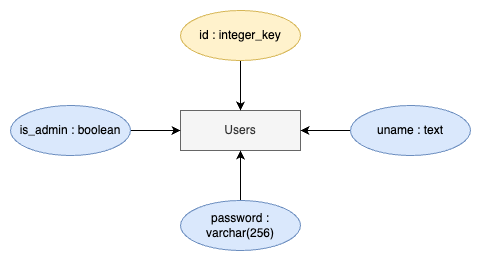
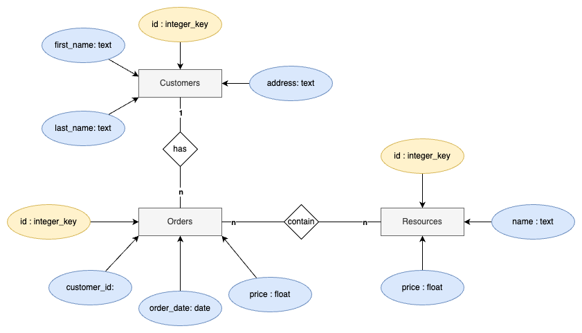

# Unit 3: Comapany Manager Application

  
"THE HEADER" by SOMEONE, *linkhere*

## Criteria A: Planning
### Problem Definition
Headphones for the New Era (in this document referred to as HNE) is a new gadget producer that creates headphones, with a special emphasis on their products’ sustainability. The founder of the company has expressed difficulties in keeping track of placed orders, financing revenue, and managing inventory with the amount of orders they are getting. As a result, HNE is planning on implementing a digital system accessible to employees to help with running the store.

HNE obtains orders 

### Proposed Solution

### Design Statement

### Success Criteria
1. The application has a log-in system to distinguish users between an admin and an employer.
   - [issue solved: “There should be a login system.”]
2. The user can search and filter orders, such as by customer, materials, date.
   - [issue solved: "d"]
3. The application allows for the user to create and log orders given from customers, and update their shipping status.
   - [issue solved: “If you’re the supplier you can view different orders you have and can update their status”]
4. The application allows the user to view the store's finances, such as the money raised and spent.
   - [issue solved: “The client should see some sort of summary on how much money he has invested into the materials he is ordering”]
5. The application allows the user to track the store's inventory, such as viewing the amount left and buying more resources.
   - [issue solved: "d"]
6. The application displays a summary of the store's activities, including orders completed, revenue raised,
   - [issue solved: "d"]

## Criteria B: Design
### System Diagram

**Fig.1** *System diagram of proposed solution*

### Application Wireframe
<iframe><style="border: 1px solid rgba(0, 0, 0, 0.1);" width="800" height="450" src="https://www.figma.com/embed?embed_host=share&url=https%3A%2F%2Fwww.figma.com%2Ffile%2Futc6ePhsfo0sHDL2E9SGdy%2FUnit-3-Wireframe%3Ftype%3Ddesign%26node-id%3D0%253A1%26mode%3Ddesign%26t%3DXxDtDB1SVSzK69rK-1" allowfullscreen></iframe>
**Fig.2** *Wireframe of the application design*

### UML Diagrams

**Fig.3** *UML diagram of proposed solution*

### ER Diagrams

**Fig.4** *ER diagram of the table Users within database*

**Fig.5** *ER diagrams of the tables Customers, Orders, and Resources and their relationships*

### Flow Diagrams

**Fig.6** *Flow diagram of*

**Fig.7** *Flow diagram of*

**Fig.8** *Flow diagram of*

### Record of Tasks
|   | Planned Action                                    | Planned Outcome                                                                                                                   | Time estimate | Target completion date | Criterion |
|---|---------------------------------------------------|-----------------------------------------------------------------------------------------------------------------------------------|---------------|------------------------|-----------|
|   | Write problem definition                          | Meet with client and finalize a description of the problem                                                                        | 20min         |                        |           |
|   | Suggest and finalize success criteria with client |                                                                                                                                   | 15min         |                        |           |
|   | Write proposed solution                           |                                                                                                                                   | 30min         |                        |           |
|   | Create wireframe for application                  |                                                                                                                                   | 2hr           |                        |           |
|   | Create test plan                                  |                                                                                                                                   | 15min         |                        |           |
|   | Create basic screens for all planned screens      | Create basic screens for all planned screens in the application, compile them into a ScreenManager                                | 1hr           | Feb 12                 |           |
|   | Create customer login function                    | Create a login function that retrieves user data from a database, allowing users to log into the application                      | 1hr           | Feb 13                 |           |
|   | Program inventory/manufacturing page              |                                                                                                                                   |               |                        |           |
|   | Program customer ordering page                    |                                                                                                                                   |               |                        |           |
|   | Create order tracking function                    | Create a order tracking function that allows both the provider side to track all orders, and customer to track their order status |               |                        |           |
|   | Program finance manager page                      |                                                                                                                                   |               |                        |           |
|   |                                                   |                                                                                                                                   |               |                        |           |
|   |                                                   |                                                                                                                                   |               |                        |           |
|   |                                                   |                                                                                                                                   |               |                        |           |
|   | Run tests                                         |                                                                                                                                   |               |                        |           |
|   | Adjust and finalize UI                            | Adjust UI components to promote user friendliness, stylize to fit company brand image                                             | 1hr 30min     |                        |           |

### Test Plan

## Criteria C: Development
### Techniques used
1. If/Else Statements
2. For/While Loops
3. Input Validation
4. Functions
5. Classes, encapsulation and decapsulation
6. Hashing
7. Databases

### Modules/Libraries used
1. hashlib